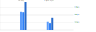

# Object keys mapping
Mapping object keys

> related: [**Object values mapping**](/benchmarks/object-values-mapping)

## Results

<table>
<thead>
<tr>
<th>tested code</th>
<th><a href=".code/simple.js">simple</a></th>
<th><a href=".code/realistic.js">realistic</a></th>
<th><a href=".code/edge-case.js">edge case</a></th>
</tr>
</thead>
<tbody>


<tr></tr><tr>

<td>

[**for key**](/benchmarks//object-keys-mapping/for-key.js)

```javascript
let keys = []

for (const key in object) {
    keys.push(key)
}
```

</td>

<td>
    <b>249 μs </b><br>
    (std. 4 μs, o. 24%)
</td>

<td>
    <b>267 μs </b><br>
    (std. 2 μs, o. 27%)
</td>

<td>
    <b>485 μs </b><br>
    (std. 4 μs, o. 29%)
</td>

</tr>
<tr></tr><tr>

<td>

[**object keys**](/benchmarks//object-keys-mapping/object-keys.js)

```javascript
let keys = Object.keys(object)
```

</td>

<td>
    <b>109 μs </b><br>
    (std. 15 μs, o. 8%)
</td>

<td>
    <b>131 μs </b><br>
    (std. 19 μs, o. 6%)
</td>

<td>
    <b>199 μs </b><br>
    (std. 18 μs, o. 6%)
</td>

</tr>

</tbody>
</table>

**std.** standard deviation, **o.** outliers 

## Chart



## Metadata

#### benchmark

<sup>normal distrubution is calculated without outliers</sup>
<br>
<b>Normal distribution samples: </b> 1000
<br>
<b>Average outliers percentage: </b> 17%
<br><br>
<sup>results are measured over multiple iterations of a code snippet</sup>
<br>
<b>Result measured over: </b> 10000 iterations

#### system

<b>Node: </b> v19.8.1
<br>
<b>CPU: </b> Intel(R) Core(TM) i7-5820K CPU @ 3.30GHz, 3900 MHz (12)
