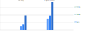

# Object values mapping
Mapping object values

> related: [**Object keys mapping**](/benchmarks/object-keys-mapping), [**Array iteration**](/benchmarks/array-iteration)

## Results

<table>
<thead>
<tr>
<th>tested code</th>
<th><a href=".code/simple.js">simple</a></th>
<th><a href=".code/realistic.js">realistic</a></th>
<th><a href=".code/edge-case.js">edge case</a></th>
</tr>
</thead>
<tbody>


<tr></tr><tr>

<td>

[**for key**](/benchmarks//object-values-mapping/for-key.js)

```javascript
let values = [];

for (const key in object) {
    values.push(object[key])
}
```

</td>

<td>
    <b>470 μs </b><br>
    (std. 3 μs, o. 23%)
</td>

<td>
    <b>690 μs </b><br>
    (std. 59 μs, o. 1%)
</td>

<td>
    <b>1.78 ms </b><br>
    (std. 18 μs, o. 17%)
</td>

</tr>
<tr></tr><tr>

<td>

[**object values**](/benchmarks//object-values-mapping/object-values.js)

```javascript
let values = Object.values(object)
```

</td>

<td>
    <b>1.36 ms </b><br>
    (std. 22 μs, o. 19%)
</td>

<td>
    <b>1.75 ms </b><br>
    (std. 23 μs, o. 2%)
</td>

<td>
    <b>3.43 ms </b><br>
    (std. 22 μs, o. 2%)
</td>

</tr>

</tbody>
</table>

**std.** standard deviation, **o.** outliers 

## Chart



## Metadata

#### benchmark

<sup>normal distrubution is calculated without outliers</sup>
<br>
<b>Normal distribution samples: </b> 1000
<br>
<b>Average outliers percentage: </b> 11%
<br><br>
<sup>results are measured over multiple iterations of a code snippet</sup>
<br>
<b>Result measured over: </b> 10000 iterations

#### system

<b>Node: </b> v19.8.1
<br>
<b>CPU: </b> Intel(R) Core(TM) i7-5820K CPU @ 3.30GHz, 3900 MHz (12)

