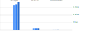

# String manipulation
Comparing string manipulation methods

> related: [**Object keys mapping**](/benchmarks/object-keys-mapping), [**Array iteration**](/benchmarks/array-iteration)

## Results

<table>
<thead>
<tr>
<th>tested code</th>
<th><a href=".code/simple.js">simple</a></th>
<th><a href=".code/realistic.js">realistic</a></th>
<th><a href=".code/edge-case.js">edge case</a></th>
</tr>
</thead>
<tbody>


<tr></tr><tr>

<td>

[**array join**](/benchmarks//string-manipulation/array-join.js)

```javascript
let s = [string, other_string].join("")
```

</td>

<td>
    <b>3.50 ms </b><br>
    (std. 20 μs, o. 13%)
</td>

<td>
    <b>3.61 ms </b><br>
    (std. 51 μs, o. 11%)
</td>

<td>
    <b>3.94 ms </b><br>
    (std. 45 μs, o. 12%)
</td>

</tr>
<tr></tr><tr>

<td>

[**backticks**](/benchmarks//string-manipulation/backticks.js)

```javascript
let s = `${string}${other_string}`
```

</td>

<td>
    <b>244 μs </b><br>
    (std. 0 μs, o. 20%)
</td>

<td>
    <b>244 μs </b><br>
    (std. 2 μs, o. 24%)
</td>

<td>
    <b>244 μs </b><br>
    (std. 0 μs, o. 20%)
</td>

</tr>
<tr></tr><tr>

<td>

[**concatenation**](/benchmarks//string-manipulation/concatenation.js)

```javascript
let s = string + other_string
```

</td>

<td>
    <b>13 μs </b><br>
    (std. 0 μs, o. 3%)
</td>

<td>
    <b>13 μs </b><br>
    (std. 0 μs, o. 2%)
</td>

<td>
    <b>16 μs </b><br>
    (std. 0 μs, o. 3%)
</td>

</tr>

</tbody>
</table>

**std.** standard deviation, **o.** outliers 

## Chart



## Metadata

#### benchmark

<sup>normal distrubution is calculated without outliers</sup>
<br>
<b>Normal distribution samples: </b> 1000
<br>
<b>Average outliers percentage: </b> 12%
<br><br>
<sup>results are measured over multiple iterations of a code snippet</sup>
<br>
<b>Result measured over: </b> 50000 iterations

#### system

<b>Node: </b> v19.8.1
<br>
<b>CPU: </b> Intel(R) Core(TM) i7-5820K CPU @ 3.30GHz, 3900 MHz (12)

